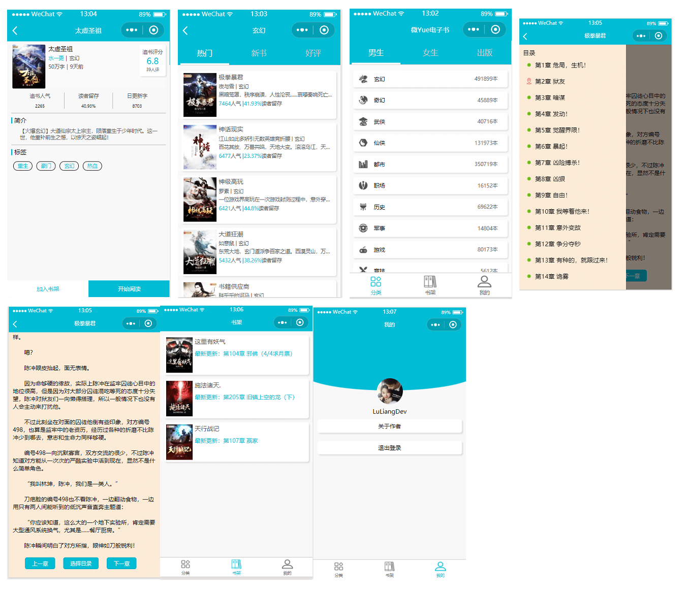

### 微Yue电子书阅读-微信小程序
#### 前言
> 微信小程序依赖微信，趋势所向，闲暇之余翻翻官方api，根据Android版学习写了一个小程序。
#### 功能模块
> 主要是用来练手学习小程序。
- 登录注册
- 添加书架
- 阅读书籍
- 书籍分类

#### 小程序预览

#### 小程序体验
> 因为书籍类小程序需要以企业身份上架，所以没法以小程序二维码的方式体验。

想要体验的直接使用
```https://github.com/LiangLuDev/WeYue-wxapp.git```
导入到微信开发者工具里面就能直接跑起来。


